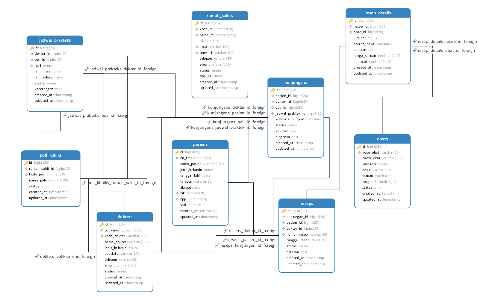

# Dokumentasi Struktur Database  
Sistem Informasi Manajemen Rumah Sakit

Dokumentasi ini menjelaskan fungsi setiap tabel, daftar kolom, tipe data, serta relasi antar tabel dalam aplikasi.

---

## 1. Tabel: `rumah_sakits`
Menyimpan informasi dasar tentang rumah sakit.

### Kolom
| Kolom        | Tipe Data      | Keterangan |
|--------------|----------------|------------|
| id           | BIGINT (PK)    | Primary key |
| kode_rs      | VARCHAR(20)    | Kode unik rumah sakit, unique |
| nama_rs      | VARCHAR        | Nama rumah sakit |
| alamat       | TEXT           | Alamat lengkap |
| kota         | VARCHAR(100)   | Kota tempat RS berada |
| provinsi     | VARCHAR(100)   | Provinsi |
| telepon      | VARCHAR(20)    | Nomor telepon |
| email        | VARCHAR        | Email rumah sakit |
| status       | ENUM           | `aktif` / `nonaktif` |
| tipe_rs      | ENUM           | `A` / `B` / `C` / `D` |
| created_at   | TIMESTAMP      | -
| updated_at   | TIMESTAMP      | -

### Relasi
- **1 rumah sakit memiliki banyak poliklinik** (`poli_kliniks`)

---

## 2. Tabel: `poli_kliniks`
Menyimpan daftar poliklinik dalam rumah sakit.

### Kolom
| Kolom            | Tipe Data    | Keterangan |
|------------------|--------------|------------|
| id               | BIGINT (PK)  | Primary key |
| rumah_sakit_id   | BIGINT (FK)  | Relasi ke `rumah_sakits` |
| kode_poli        | VARCHAR(20)  | Kode poli, unique |
| nama_poli        | VARCHAR(100) | Nama poliklinik |
| status           | ENUM         | `aktif` / `nonaktif` |
| created_at       | TIMESTAMP    | - |
| updated_at       | TIMESTAMP    | - |

### Relasi
- **FK:** `rumah_sakit_id` → `rumah_sakits.id`
- **1 poli** dapat dipakai di **jadwal praktek**, **dokter**, dan **kunjungan**

---

## 3. Tabel: `dokters`
Menyimpan data dokter.

### Kolom
| Kolom        | Tipe Data           | Keterangan |
|--------------|---------------------|------------|
| id           | BIGINT (PK)         | Primary key |
| nama         | VARCHAR             | Nama lengkap dokter |
| spesialis    | VARCHAR             | Spesialisasi dokter |
| poli_id      | BIGINT (FK)         | Relasi ke poliklinik |
| sip          | VARCHAR             | Nomor Surat Izin Praktek |
| created_at   | TIMESTAMP           | - |
| updated_at   | TIMESTAMP           | - |

### Relasi
- FK: `poli_id` → `poli_kliniks.id`
- 1 dokter memiliki banyak jadwal praktek
- 1 dokter memiliki banyak kunjungan

---

## 4. Tabel: `pasiens`
Menyimpan data pasien.

### Kolom
| Kolom             | Tipe Data      | Keterangan |
|-------------------|----------------|------------|
| id                | BIGINT (PK)    | Primary key |
| nik               | VARCHAR(20)    | Nomor NIK unik |
| nama              | VARCHAR        | Nama pasien |
| jenis_kelamin     | ENUM           | `L` / `P` |
| tanggal_lahir     | DATE           | Tanggal lahir |
| alamat            | TEXT           | Alamat |
| telepon           | VARCHAR(20)    | Nomor HP |
| created_at        | TIMESTAMP      | - |
| updated_at        | TIMESTAMP      | - |

### Relasi
- 1 pasien dapat memiliki banyak kunjungan
- 1 pasien dapat memiliki banyak resep

---

## 5. Tabel: `obats`
Menyimpan daftar obat.

### Kolom
| Kolom        | Tipe Data         | Keterangan |
|--------------|-------------------|------------|
| id           | BIGINT (PK)       | Primary key |
| kode_obat    | VARCHAR(20)       | Kode unik |
| nama_obat    | VARCHAR           | Nama obat |
| satuan       | VARCHAR           | Misal: tablet, botol |
| stok         | INTEGER           | Jumlah stok |
| created_at   | TIMESTAMP         | - |
| updated_at   | TIMESTAMP         | - |

### Relasi
- Obat dipakai di `resep_details`

---

## 6. Tabel: `jadwal_prakteks`
Menyimpan jadwal praktek dokter tiap hari.

### Kolom
| Kolom            | Tipe Data         | Keterangan |
|------------------|-------------------|------------|
| id               | BIGINT (PK)       | Primary key |
| dokter_id        | BIGINT (FK)       | Relasi ke dokter |
| poli_id          | BIGINT (FK)       | Relasi ke poliklinik |
| hari             | ENUM              | Senin–Minggu |
| jam_mulai        | TIME              | Waktu mulai |
| jam_selesai      | TIME              | Waktu selesai |
| created_at       | TIMESTAMP         | - |
| updated_at       | TIMESTAMP         | - |

### Relasi
- 1 jadwal dapat digunakan oleh banyak kunjungan

---

## 7. Tabel: `kunjungans`
Menyimpan data kunjungan pasien ke rumah sakit.

### Kolom
| Kolom              | Tipe Data        | Keterangan |
|--------------------|------------------|------------|
| id                 | BIGINT (PK)      | Primary key |
| pasien_id          | BIGINT (FK)      | Pasien yang datang |
| dokter_id          | BIGINT (FK)      | Dokter pemeriksa |
| poli_id            | BIGINT (FK)      | Poli (opsional) |
| jadwal_praktek_id  | BIGINT (FK)      | Jadwal praktek (opsional) |
| waktu_kunjungan    | DATETIME         | Waktu kedatangan |
| status             | ENUM             | menunggu, diperiksa, selesai, batal |
| keluhan            | TEXT             | Keluhan pasien |
| diagnosa           | TEXT             | Diagnosa dokter |
| created_at         | TIMESTAMP        | - |
| updated_at         | TIMESTAMP        | - |

### Relasi
- FK: pasien → pasiens  
- FK: dokter → dokters  
- FK: poli → poli_kliniks  
- FK: jadwal → jadwal_prakteks  
- Digunakan pada tabel `reseps`

---

## 8. Tabel: `reseps`
Menyimpan data resep utama.

### Kolom
| Kolom         | Tipe Data     | Keterangan |
|---------------|---------------|------------|
| id            | BIGINT (PK)   | Primary key |
| kunjungan_id  | BIGINT (FK)   | Relasi ke kunjungan |
| pasien_id     | BIGINT (FK)   | Pasien |
| dokter_id     | BIGINT (FK)   | Dokter |
| catatan       | TEXT          | Catatan tambahan resep |
| created_at    | TIMESTAMP     | - |
| updated_at    | TIMESTAMP     | - |

### Relasi
- 1 resep memiliki banyak `resep_details`

---

## 9. Tabel: `resep_details`
Menyimpan detail obat dalam resep.

### Kolom
| Kolom        | Tipe Data     | Keterangan |
|--------------|---------------|------------|
| id           | BIGINT (PK)   | Primary key |
| resep_id     | BIGINT (FK)   | Relasi ke resep |
| obat_id      | BIGINT (FK)   | Obat yang diresepkan |
| jumlah       | INTEGER       | Jumlah unit |
| aturan_pakai | TEXT          | Cara penggunaan |
| created_at   | TIMESTAMP     | - |
| updated_at   | TIMESTAMP     | - |

---

## Diagram Relasi (Ringkas)

